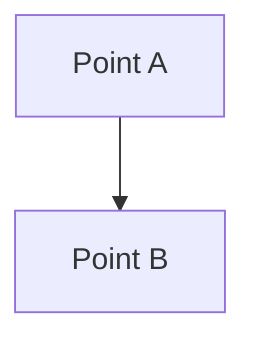

# Bienvenido a la Wiki de GitHUB

## Hola Mundo



## Botones

Aqui van los botones

## Contenido

Elemento|Siglas|Descripción
---|---|---
A|A|A
A|A|A
A|A|A

## Ejemplo de Código

```javascript
function ejemplo(a, b) {
    return a + b;
}
```